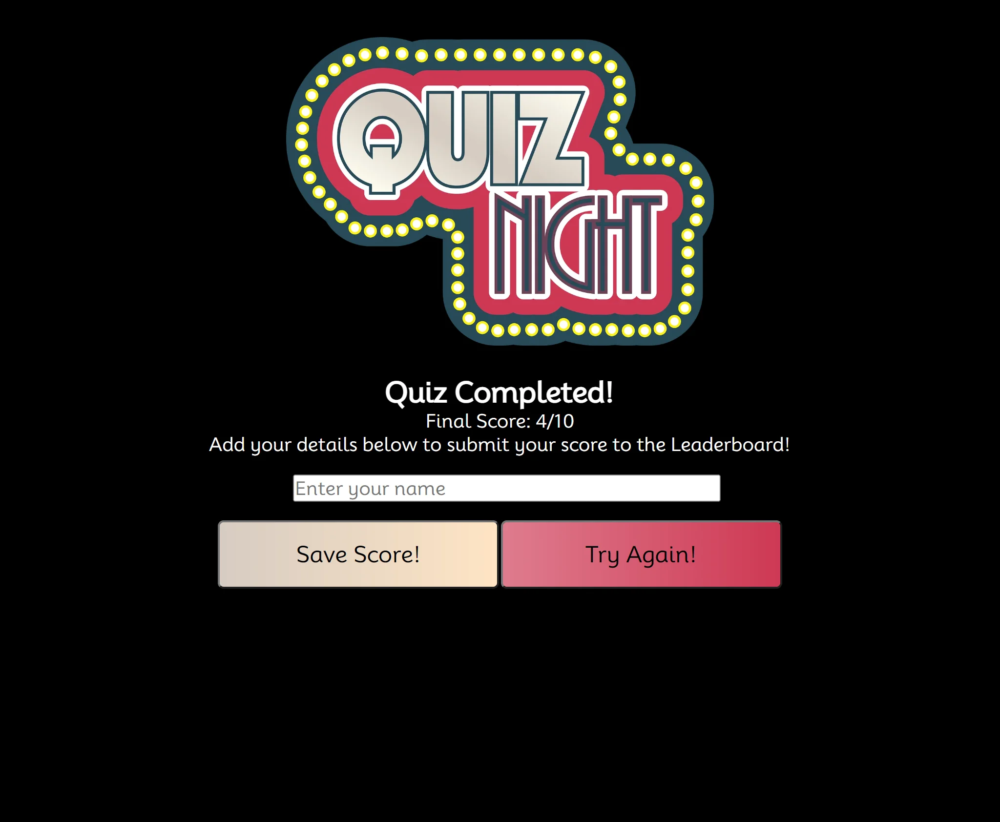
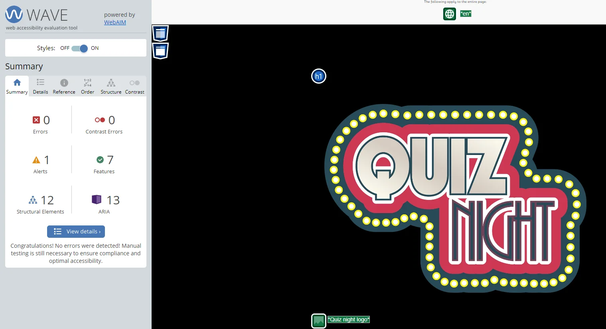
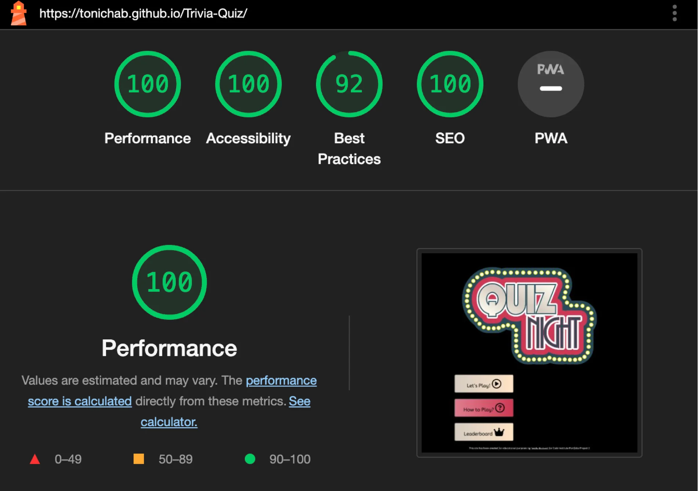

# Quiz Night Trivia Quiz

Visit the live website [here!](https://tonichab.github.io/Trivia-Quiz/)

Quiz Night is an online trivia quiz for users wanting to have fun with friends testing their general knowledge. The objective is to try and answer multiple choice questions correctly

---

## Contents

- [Quiz Night Trivia Quiz](#quiz-night-trivia-quiz)
  - [Contents](#contents)
  - [User Experience](#user-experience)
    - [Target Audience](#target-audience)
    - [User Expectations](#user-expectations)
    - [User Stories](#user-stories)
  - [Design](#design)
    - [Wireframes](#wireframes)
    - [Colour Palette](#colour-palette)
    - [Typography](#typography)
  - [Features and Functionality](#features-and-functionality)
    - [Start Page](#start-page)
    - [Main Quiz Page](#main-quiz-page)
    - [End Page](#end-page)
    - [How To Play Pop Up](#how-to-play-pop-up)
    - [Leaderboard Pop Up](#leaderboard-pop-up)
    - [Notifications](#notifications)
    - [Future Development](#future-development)
    - [Accesibility](#accesibility)
  - [Technologies Used](#technologies-used)
    - [Languages Used](#languages-used)
  - [Deployment and Local Development](#deployment-and-local-development)
    - [Deployment](#deployment)
    - [Local Development](#local-development)
      - [How to Fork](#how-to-fork)
      - [How to Clone](#how-to-clone)
  - [Testing](#testing)
    - [Validators](#validators)
      - [HTML](#html)
      - [CSS](#css)
      - [JS Hint](#js-hint)
      - [Lighthouse](#lighthouse)
      - [WebAim](#webaim)
    - [Bug Fixes](#bug-fixes)
  - [Credits](#credits)
    - [Code Used](#code-used)
    - [Content](#content)
    - [Media](#media)
    - [Acknowledgements](#acknowledgements)

---

## User Experience

### Target Audience

This site is targeted for webusers everywhere who want to test their general knowledge. It can be used by single users testing their knowledge, or in group settings to have fun. All that is needed is a web browser with JavaScript enabled to make full use of the quiz. The site has a competitive aspect through users comparing their scores through the leaderboard.

### User Expectations

- An effective navigation system amendable for all screen sizes.
- Easy to locate instructions and leaderboard sections, accessible from the start screen.
- A perceptive game interface with clear controls and notifications aiding in the gameplay.
- A clear way in which to save the score for comparison on the leaderboard.
- A simply way to restart the quiz without navigating through the start page.
- A practical quiz website available to view on all devices.

### User Stories

1. As a player, I want a smooth functional experience with quick loading times for an enjoyable experience.  
The design of the website is intentionally simple to allow for quick loading times. All iamges used are also in WEBP format as the current quickest for web use.  

2. As a player, I want to see my score progress as I play the quiz.  
The quiz interface includes an interactive score tracker that shows the users how many correct answers they have throughout the quiz.  

3. As a player, I want to be notified if my answer is correct or incorrect.  
As each answer is selected a clear notification will appear on all devices to confirm whether or not the users answer is correct, whilst the next question is able to load in the background.  

4. As a player, I want the ability to save my score to compare with other users. 
Once a player has completed the quiz they will be prompted to add a username in order to save their score to view on the leaderboard.  

5. As a player, I want to easily start the quiz again without needing to go back to the start page.  
Once the quiz has completed, the player can restart the quiz using a Try Again button without needing to save their score or start from the main page.  

6. As a player, I want to compare my score with other users through a leaderboard.  
From the main page a user can view the leaderboard to see scores previously saved. Currently these scores will pull from a users local storage.  

7. As a player, I want a webpage with an appropriate amount of content so as not to distract me from the quiz. 
The site is kept simple to allow the players a straight forward experience without overly complicated navigation or functions.  
[Back to Contents](#contents)

---

## Design

### Wireframes

Using Balsamiq during the planning stage of this build I was able to create wireframes for each page and mobile view to use as a guide when building the website. 

Desktop 
 

Mobile 

### Colour Palette

Inspiration was taken from the quiz logo image to source the colour palette for this site, which has allowed for consistency throughout the site. The below shows the colour scheme selected, whilst also confirming the accessibility of the colours for colour blind users. Text throughout the site is either black or white to allow for the best contrast against any background. 

### Typography

The site contains one main font, Mooli, for all text throughout. I have chosen to keep to this font throughout as it has created consistency and is clear and easy for users to read. 

 
[Back to Contents](#contents)

---

## Features and Functionality

### External Trivia API

A main feature of this site is the use of an external [Trivia API](https://the-trivia-api.com/) which is regularly updated with an extensive database of trivia quiz questions and answers. The benefits of this mean a user is less likely to be faced with the same questions more than once, creating a new experience for both new and returning players. 

The data has been obtained from a range of sources:

- User submissions
- SPARQL queries to Wikidata used to procedurally generate questions.
- Large Language Models backed by ground truth
- Scripts to scrape and build questions from information on public websites. 

All questions are reviewed before being made available through the API to ensure they are suitable.

### Search Engine Optimization

In order to improve the optimisation of the website's content relevance, and the quality and quantity of website traffic I have included meta tags within the head elements. These tags will create a small description for the website when coming up within the output of a search engine, alongside the addition of keywords to increase the ranking of the website on the search engine's output.

### Start Page

The starting page for the site shows the main site logo image, with clearly demonstrating buttons to navigate to the quiz, see how to play, or view the leaderboard. The start page consists of 3 main buttons that are easy to locate for the user. Firstly, there is a Let's Play button that allows the user to start the quiz straight away should they wish. This is better for repeat users who may not need to view the instructions again. A how to play button will open a pop up with instructions to help new players before starting the quiz. Lastly there is a button to open a leaderboard pop up, currently available to show any locally stored saved scores to the user, encouraging them to try the quiz again to beat their scores. 
Desktop  
 
Mobile  

### Main Quiz Page

Once the quiz is started, the main quiz page will appear, presenting the player with their first question and multiple choice answers to select from. There is also a score indicator allowing the user to keep track of their score as they progress through the quiz. For each question answered, a notification will appear to confirm to the user whether they have answered correctly, or incorrectly. 
Desktop 
  
Mobile 

### End Page

At the end of the quiz the player will be taken to a final page, giving them to option to save their score should they wish. When the user selects to save their score they will also be taken back to the main page so they can view their newly saved score on the leaderboard. If a player hasn't done as well as they hoped, they do also have the option to restart the quiz without needing to save their score. 
Desktop  
  
Mobile  

### How To Play Pop Up

From the main page, if the How to Play button is selected the player will be presented with the following pop up containing the instructions for playing the quiz. This pop up can then be closed by the user allowing them to proceed to play when they are ready to do so. 

### Leaderboard Pop Up

From the main page, if the Leaderboard button is selected, the player will be presented with the following pop up, which over time will show a high scores list of previously saved scores by the user. This will encourage players to save their scores to try and reach the top of the leaderboard. 

### Notifications

At various stages within the site there will be notifications shown to the user as feedback to their actions. Firstly is the correct answer notification appearing on the main quiz page. Each time the player answers correctly a notification will appear to confirm this to them. Similarly if the player answers incorrectly, and notification will appear to advise them of this. After the quiz has been completed, should the user choose to save their score a notification will appear to confirm their score has been successfully saved. If the score has been saved under the same username previously, or no username is provided, an error notification will appear to advise the player. 
Correct  
 
Incorrect  
 
Score Saved  
 
Score Already Saved  
  
Username Required  

### Footer

I have included a footer to the site noting the purpose of this project to complete my course with Code Institute. There is an external link to my GitHub profile so users can view other projects if they have enjoyed the quiz. 

### Future Development

In future developments of this project I would like to build a backround database for the storage of user scores, so that the leaderboard function would also users from around the globe to compare their scores. Currently this will be limited to only show previous scores from the same device using local storage. 

An additional feature I would include would be difficulty levels for the quiz. This would allow users control over the difficulty of the questions best suited for them, whilst also allowing for an additional sense of achievement for those able to work through the different difficulty levels. 

Lastly I would like to develop a feedback form for players to complete and share feedback on the quiz. This could include feedback regarding any of the questions/answers to ensure the quiz is correct, or feedback on the mechanics of the quiz to improve the user experience.

### Accesibility

To provide accessibility to the website the following has been incorporated;

1. Aria-labels, alt tags and labels have been used for supportive technologies such as screen readers.
2. Semantic elements have been used for easy navigation through each page.
3. The colour scheme selected is also made suitable for colour-blind users as shown in the design section above.
4. I have also carried out accessibility checks using the WAVE Chrome Extension which has confirmed no accessibility errors. Please see the below results for the site; 

 
[Back to Contents](#contents)

---

## Technologies Used

The following technologies have been utilised in the production of this website;

- HTML5- The core of the website has been built with HTML5.
- CSS- The website styling has been completed using CSS.
- Javascript- In order to utilise the Font Awesome icons a script had to be added using Javascript. Javascript has also been used for the functionality of the website.
- GitHub- Storage and publishing of the website has been done through GitHub.
- GitHub Pages- The website has been published through GitHub Pages.
- Codeanywhere- This is the IDE used to edit and push changes for the website.
- Font Awesome- Icons such as the social media icons were obtained through the Font Awesome website.
- Favicon Generator Website- I have used this website to generate the favicon code for my chosen image.
- Google Chrome- The majority of the website testing and building has been done with the assistance of Google Chrome and the Developer Tools.
- Pixelied.com Website- I have used this website to convert my images from JPEG/PNG to WEBP.
- Python- Via the terminal in Codeanywhere I have used python3 in order to preview the website using a local HTTP server.
- AmIResponsive Website- To view overall functionality across devices I have used the AmIResponsive website.
- Trivia API- To source the questions and answers content for the quiz.

### Languages Used

HTML, CSS, Javascript  
[Back to Contents](#contents)

---

## Deployment and Local Development

### Deployment

The Trivia Quiz Website has been deployed to Git Pages.

### Local Development

#### How to Fork

If you would like to fork the repository:

1. Log in (or sign up) to your account on GitHub.
2. Go to the repository for this project- /TonichaB/Trivia-Quiz/
3. Click on the Fork button in the top right corner.

#### How to Clone

If you would like to clone this repository:

1. Log in (or sign up) to your account on GitHub.
2. Go to the repository for this project- /TonichaB/Niche-Crystals/
3. Click on the code button, and copy your preferred clone link.
4. Open the terminal in your code editor and change the current working directory to the location you want to use for the cloned directory.
5. Type 'git clone' into the terminal and paste the link copied in step 3 above. Press enter.  
[Back to Contents](#contents)

---

## Testing

Testing was completed on the following devices to confirm the responsiveness of the site:

- Macbook Pro
- Lenovo Desktop
- Samsung S21 FE mobile
- Ipad Pro

The Niche Crystals site has been tested using the following browsers:

- Google Chrome
- Safari
- Firefox

|       Feature        |                                      Expected Outcome                                       |                     Testing Performed                      |                        Result                         | Pass/Fail |
| :------------------: | :-----------------------------------------------------------------------------------------: | :--------------------------------------------------------: | :---------------------------------------------------: | :-------: |
|  **Main Page**  |
|                      |                                                                                             |                                                            |                                                       |           |
| Lets Play Button |                    When clicked the user should be taken to the main quiz page                     |                       Clicked Lets Play Button                        |                Redirected to main quiz page                |   Pass    |
|   How to Play Button   |              When clicked the how to play pop up should appear, replacing the main page              |                  Clicked How to Play                   |           How to play pop up appears, replacing main page          |   Pass    |
|   Leaderboard Button    |                 When clicked the leaderboard pop up should appear, replacing the main page                  |                        Clicked Leaderboard Button                        |                Leaderboard pop up appears, replacing the main page               |   Pass    |
|  Close Pop Ups Button   |                When clicked the pop up should close and the main page reappear               |                        Clicked the X icon                        |              Pop up closed and main page appears               |   Pass    |
|  **Main Quiz**   |                                |                                                |                             |       |
|          |    |     |    |       |
|     Answer Buttons    |           When clicked a notification should appear confirming if answer is correct/incorrect and new content should load            |                       Clicked Answer Buttons                        |      Appropriate notification appears and new content is loaded     |   Pass    |
|    Incrementing Score   |                    When correct answer is selected the user score should increase by 1                   |                    Selected correct answer                     |                      Score increased by 1                      |   Pass    |
|   **End Page**   |
|                      |                                                                                             |                                                            |                                                       |           |
|     Save Score Button- Username Given    | When clicked username and score should save to leaderboard, and user should be redirected to the main page | Clicked Save Score button | Score saved notification appears and user is redirected back to main page |   Pass    |
|     Save Score Button- Username Not Given    | When clicked notification will apear to prompt user to input their username in order to save | Clicked Save Score button without username input. | Notification appears asking for a username |   Pass    |
|     Score Saves to Local Storage    | When save button is clicked, using chrome developer tools the application tab should show the newly saved data to the local storage | Clicked Save Score button | Score and username appears as saved data via chrome developer tools |   Pass    |
|     Try Again Button     |                      When clicked, quiz page should appear with new content, and user score should reset to 0                      |                    Clicked Try Again button                    |                  Quiz restarts with new content and score resets to 0                 |   Pass    |

### Validators

#### HTML

#### CSS

#### JS Hint

#### Lighthouse

#### WebAim

WebAim is a useful tool to check the contrast of text vs background colour; I have used this to compare the colours of the buttons and notifications within the site to ensure they provide an acceptable contrast ratio.  

D6CCC2: 
This is the colour used for the Lets Play, Leaderboard and Save Score Buttons. 
 
DE7C8E:  
This is the colour used for the How to Play, Try Again, and Answer buttons, as well as the background colour for the pop ups. 
 
B20101:  
This is the colour used for any error type notifications.  
 
00610B:  
This is the colour used for any success type notifications.  

### Bug Fixes

During the process of building the quiz I came accross a couple of bugs to be fixed.

1. The first bug I came across related to the functionality of the start page buttons. The play button to start the quiz was not functioning, and the instructions and how to play buttons would open the relevant divs but showing at the bottom of the page. I spoke with my Mentor, Luke, who pointed out the sections of my code causing the bug, making use of the Google Developer Tools. Using his guidance and further testing with Google Developer Tools, I sourced the issue to the javascript functions to hide the start page when each button is clicked.
2. When working with the end page functionalities, I came accross the second bug. Despite entering in a username to save the score achieved, an additional alert was appearing asking again for the username to be given before saving. Following this the score would not be saved in the local storage for the device to be displayed on the leaderboard.  
  
I was able to resolve this issue by removing a prompt in my Javascript code so that only the input field would request a username be added.
3. An additional bug I faced appeared when attempting to save the end score using the save score button. Despite adding in a username the function to save the score was unsuccessful, preventing the remaining functions from running to take the user back to the start page. I was able to work through this issue again with my Mentor Luke and we were able to make some amendments to the JavaScript functions allowing the save button to become functional again. 
4. The last bug I came accross occured once the save button became functionable. When a user saved their score, and chose to run the quiz again, the score would save in mulitples increasing each session. Working with the aid of Chrome Developer tools I was able to source the error so that each score is only saved once to the local storage. 
[Back to Contents](#contents)

---

## Credits

### Code Used

To assist with the building of this quiz I have made use of the following;

- As a general guide to build the quiz I have referred to the following YouTube tutorials:
  - [Brian Design](https://www.youtube.com/watch?v=f4fB9Xg2JEY)
  - [Codehal](https://www.youtube.com/watch?v=Vp8x8-reqZA)
- The following websites have also been used for guidance with the code used:
  - [Michael Karen](https://michael-karen.medium.com/how-to-save-high-scores-in-local-storage-7860baca9d68) This page was used to assist with saving high scores for the leaderboard feature.
- I have utilised [Trivia API](https://the-trivia-api.com) to generate the questions and answers for the quiz.

### Content

The icons used on the home page of the quiz have been sourced from [Font Awesome](https://fontawesome.com/)

### Media

### Acknowledgements

I would like to acknowledge Code Institute and their Full Stack Development course which has assisted me in building the site.

I would also like to thank my fellow students and members of the Stack community whose contributions within the Slack channels have proven to be very helpful when facing challenges during the project.

Lastly I would like to thank my Mentor Luke who helped me overcome my biggest bug hurdle when completing the project. 
[Back to Contents](#contents)
